### `meet@github ~ $ ./contributions.sh`

 

### `meet@github ~ $ whoami`

<table>
  <tr>
    <td valign="top"></td>
    <td valign="top"></td>
  </tr>
</table>

### `meet@github ~ $ ./links.sh`

<a href="https://github.com/Meetdonda">GitHub</a> · <a href="mailto:meetdonda.me@gmail.com">Email</a>

